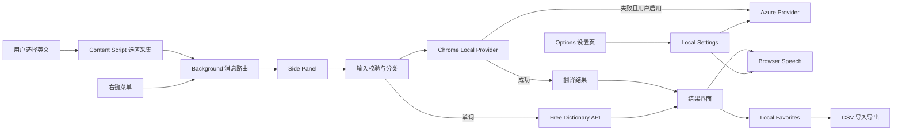

# Translator 第一阶段最终设计方案

文档版本：1.0  
对应软件版本：1.0.0-rc.1  
维护基线：`Wq5881898/translator`  
最后更新：2026-07-29

## 1. 文档目的

本文记录第一阶段最终实现的产品边界、功能架构、模块职责、数据流、接口策略、安全约束、测试方式和后续演进方向。后续维护应优先参考本文、代码和测试，不依赖聊天上下文。

## 2. 设计原则

1. **轻量优先**：不引入非必要框架、后端和账户系统。
2. **本地优先**：默认使用 Chrome 本地翻译，收藏和设置保存在浏览器本地。
3. **显式云端**：Azure 仅作为用户主动配置的可选备用。
4. **最小上传**：只允许发送当前选中文字或单词，不发送网页、截图、收藏和音频。
5. **可替换 Provider**：翻译来源与界面、收藏逻辑分离。
6. **失败可恢复**：错误显示在用户当前操作所在界面，按钮必须退出忙碌状态。
7. **版本可验证**：CI 保护类型、业务规则、构建、权限和发布包。

## 3. 第一阶段功能范围

### 已实现

- 普通网页自动划词翻译；
- 鼠标、键盘和选区变化监听；
- 右键菜单备用翻译；
- 单词、句子、短段落分类；
- Chrome 本地英译中；
- Azure 可选备用；
- 免费词典音标查询；
- 浏览器本地发音和英美音切换；
- 单词、句子爱心收藏；
- 隐藏式收藏弹窗；
- UTF-8 CSV 导入导出；
- 设置、本地数据清除和隐私说明；
- 输入校验、超时、Provider、存储和导入错误；
- 自动化测试、CI、构建和发布包验证。

### 明确暂缓

- 翻译次数统计；
- Windows 截图与本地 OCR；
- PPT、Word、PDF 专用插件；
- GPT 自动调用；
- 牛津、朗文等商业词典内容；
- 浏览器商店正式发布；
- 账户、云同步、分析和广告。

## 4. 总体功能架构



## 5. 技术栈

- 浏览器扩展标准：Manifest V3；
- 构建框架：WXT 0.20；
- 语言：TypeScript；
- 界面：React 19；
- 测试：Vitest；
- 运行时要求：Node.js 22 或更高版本；
- 数据持久化：`browser.storage.local`；
- CI：GitHub Actions。

第一阶段没有引入 Redux、数据库库、服务端 API、用户系统或复杂状态管理。

## 6. 目录与模块职责

```text
entrypoints/
  background.ts                 后台服务、右键菜单、消息路由
  content.ts                    网页选区读取和自动触发
  sidepanel/
    App.tsx                     翻译、发音、收藏和状态主界面
    FavoritesTransferControls.tsx CSV 导入导出及弹窗内反馈
    style.css                   侧边栏和收藏弹窗样式
  options/
    App.tsx                     设置、隐私提示和本地数据清除

src/core/
  messages.ts                   扩展消息协议和类型守卫
  selection.ts                  文本规范化与分类
  favorites.ts                  收藏模型、去重、添加和删除
  favorites-transfer.ts         CSV 序列化、解析、校验和合并
  settings.ts                   设置模型、默认值和规范化
  speech.ts                     浏览器语音适配层
  translation-guard.ts          输入校验和超时封装

src/providers/
  translation-provider.ts       统一 Provider 契约
  chrome-translation-provider.ts Chrome 本地翻译与词典组合
  azure-translation-provider.ts Azure 备用翻译
  mock-translation-provider.ts  测试或基础验证 Provider

scripts/
  verify-release.mjs            发布包、Manifest 和文档核验

docs/
  INSTALLATION.md               安装说明
  TEST_REPORT_STAGE_1.md        第一阶段测试报告
  RELEASE_CHECKLIST.md          发布检查表
```

文件名称以后允许演进，但模块职责和边界应保持清晰。

## 7. 核心流程设计

### 7.1 自动划词

1. Content Script 监听鼠标结束、键盘选择和 `selectionchange`。
2. 延迟读取最终稳定选区，避免读到拖选过程中的半成品。
3. 选区为空时重置上一次选择去重状态。
4. 对文本做规范化和基础英文检测。
5. 通过消息协议把选择发送到后台或侧边栏。
6. 已打开页面在扩展重新加载后必须刷新，才能注入新 Content Script。

### 7.2 右键备用

Background 注册选中文本上下文菜单。用户触发后，选区通过同一消息和翻译链路处理，避免维护第二套业务逻辑。

### 7.3 输入校验

`translation-guard.ts` 负责：

- 合并连续空白；
- 拒绝空文本；
- 拒绝没有英文字母的内容；
- 限制最大 5000 字符；
- 为异步操作提供超时包装。

界面和 Provider 不应分别复制这些规则。

### 7.4 翻译 Provider

统一输入是英文文本，统一输出包含：

- 原文；
- 中文译文；
- 类型；
- Provider 名称；
- 可选音标等单词信息。

默认链路：

```text
Chrome 本地翻译
  ├─ 成功：返回结果
  └─ 失败：
       ├─ 未启用 Azure：显示本地错误
       └─ 已启用 Azure：调用 Azure 备用
```

Azure Key 不进入 Content Script，也不写入源代码。设置页把配置保存到扩展本地存储。

### 7.5 单词词典信息

单词翻译完成后可向 Free Dictionary API 查询音标等信息。词典请求有独立超时；词典失败不应破坏已经成功的中文翻译。

### 7.6 发音

`speech.ts` 隔离 Web Speech 的原生对象：

- 根据设置选择英式或美式语音；
- 新播放会停止上一段；
- 支持主动停止；
- 失败返回用户可理解的信息；
- 不请求麦克风，不上传录音。

### 7.7 收藏

`FavoriteEntry` 统一保存：

- 稳定 ID；
- `word` 或 `sentence`；
- 英文；
- 中文；
- 可选音标；
- 首次收藏时间。

单词 ID 使用规范化小写文本，句子 ID 使用规范化完整句子。添加收藏前去重；取消收藏不影响其他项目。

第一阶段刻意不实现翻译次数统计，因此数据模型中不应伪造或展示次数。

### 7.8 收藏弹窗

收藏列表覆盖侧边栏显示，默认隐藏。这样大量收藏不会挤压翻译结果。

收藏操作反馈遵循“就近显示”原则：

- 翻译与发音错误显示在翻译页；
- CSV 进度、成功和失败显示在收藏弹窗；
- 设置保存和清除显示在设置页。

### 7.9 CSV 导出

导出使用 UTF-8 和 BOM，兼容 Excel。列顺序固定：

```text
Type,English,Phonetic,Chinese translation,First saved
```

所有内容通过 CSV 引号规则转义，支持逗号、引号、中文和换行。

### 7.10 CSV 导入

导入分为解析、全量校验、去重、合并、持久化五步：

1. 去除 UTF-8 BOM；
2. 解析带引号 CSV；
3. 检查标题和每行五列；
4. 校验类型、英文、中文和首次收藏时间；
5. 所有行有效后才执行合并和保存。

任意一行无效时整次导入失败，不产生部分写入。错误包含 CSV 行号。无论成功或失败，`finally` 都必须结束忙碌状态。

## 8. 状态和数据模型

### 8.1 设置

```ts
type TranslatorSettings = {
  pronunciation: 'en-US' | 'en-GB';
  useAzureFallback: boolean;
  azureKey: string;
  azureRegion: string;
};
```

实际字段名称以代码类型为准。新增设置时必须提供默认值和旧数据规范化逻辑。

### 8.2 收藏

```ts
type FavoriteEntry = {
  id: string;
  kind: 'word' | 'sentence';
  originalText: string;
  translatedText: string;
  firstFavoritedAt: string;
  phonetic?: string;
};
```

`firstFavoritedAt` 使用 ISO 8601 字符串，便于 CSV、排序和跨地区解析。

### 8.3 本地存储

收藏和设置保存在扩展自己的 `browser.storage.local` 空间。写入失败必须：

- 不更新内存中的成功状态；
- 显示可恢复错误；
- 避免未处理 Promise rejection。

## 9. 隐私与权限

Manifest 预期权限：

- `contextMenus`
- `sidePanel`
- `storage`

预期外部域名：

- Azure Translator：仅可选备用；
- Free Dictionary API：仅单词音标。

禁止无需求新增：

- 浏览历史；
- 全部标签页；
- 下载管理；
- 剪贴板；
- 麦克风；
- 摄像头；
- 定位；
- 截图权限。

若未来新增权限，必须同步更新 `PRIVACY.md`、安装说明、发布核验脚本和测试报告。

## 10. 错误处理标准

错误信息应回答三个问题：

1. 发生了什么；
2. 用户可以做什么；
3. 是否会影响现有数据。

必须覆盖：

- 空文本或非英文；
- 5000 字符上限；
- Chrome Translator API 不支持；
- 模型下载或创建失败；
- 翻译超时；
- Azure Key、Region 或 HTTP 错误；
- 免费词典超时；
- 收藏读取或保存失败；
- CSV 标题、列数、字段和日期错误；
- 发音不可用。

任何异步按钮必须在成功和失败后解除禁用状态。

## 11. Chrome 语言包策略

Chrome Translator 的语言包不能随扩展打包。模型由浏览器下载、更新、共享和清理。

第一阶段保持当前行为。后续可以增加首次使用引导：

```text
检测 availability
  ├─ available：直接翻译
  ├─ downloadable：显示“准备离线翻译”
  ├─ downloading：显示下载进度
  └─ unavailable：显示兼容性说明和可选备用方案
```

不要为了消除首次下载而把大型第三方模型直接放入插件；这会破坏轻量目标，并引入模型许可、体积、内存和更新问题。

## 12. GPT 与专业词典后续方案

### 12.1 免费个人词库

优先方案是允许用户将自己整理或由 ChatGPT 手动辅助生成的 CSV 词库导入本地。查词顺序可演进为：

```text
个人词库 → 本地缓存 → 免费开放词典 → Chrome 本地翻译 → 可选云端
```

GPT 生成内容只能标记为学习辅助解释，不能冒充牛津或朗文释义。

### 12.2 GPT 自动调用

作为默认关闭的可选 Provider：

- 用户自行配置 API Key；
- 只发送当前选中文字；
- 与 ChatGPT 会员分开计费；
- 需要明确成本提示、超时和预算控制；
- 不作为唯一音标或权威词典来源。

### 12.3 牛津和朗文

不得抓取网页或打包商业词典内容。只有获得对应 API 和本地缓存授权后才能接入，并需要：

- 独立 Provider；
- 授权和品牌声明；
- 缓存限制；
- 调用额度与错误处理；
- 第三方许可记录。

## 13. 测试与 CI

当前 CI 顺序：

1. 安装依赖；
2. WXT 类型生成；
3. TypeScript 严格类型检查；
4. Vitest 单元测试；
5. Manifest V3 生产构建；
6. 发布包、权限、域名、版本和文档校验；
7. 上传可直接加载的插件 ZIP。

核心自动化测试覆盖：

- 文本分类和规范化；
- Chrome、Azure 和 Mock Provider；
- 输入校验和超时；
- 设置规范化；
- 发音播放、停止和错误；
- 收藏添加、删除和去重；
- CSV Unicode、引号、往返、错误行、合并和去重。

发布前还应执行 Chrome 人工回归；Edge 至少执行基本烟雾测试。

## 14. 开发与发布命令

```bash
npm install
npm run dev
npm run typecheck
npm test
npm run check
npm run build
npm run verify:release
```

Node.js 版本必须满足 `>=22`。

## 15. 维护规则

1. 先修改类型和核心业务函数，再修改界面。
2. Provider 不直接操作收藏或 React 状态。
3. Content Script 不保存 API Key。
4. 所有新增存储字段必须有默认值和迁移策略。
5. 所有新增导入格式必须先全量校验再写入。
6. 用户在哪个窗口操作，结果和错误就显示在哪个窗口。
7. 修复用户缺陷时补充回归测试和测试报告。
8. 发布分支必须通过 CI 后才能合并。
9. 不把 GitHub Actions 临时下载链接写入长期文档。
10. 功能范围变化时同步更新 README、设计方案、用户说明、隐私政策和测试报告。

## 16. 后续建议优先级

### P1：首次使用体验

- 本地语言包可用性检测；
- 用户主动触发下载；
- 下载进度和重试；
- 浏览器兼容性诊断。

### P1：个人学习词库

- 独立的个人词库 CSV；
- 个人词库优先匹配；
- 来源标记；
- 导入预览和字段映射。

### P2：截图 OCR

- 独立桌面能力或受控截图入口；
- 本地 OCR；
- OCR 后销毁截图；
- 云端只接收识别文字；
- 复用现有翻译、发音和收藏模块。

### P2：可选智能增强

- GPT 用户自带 Key；
- 语境解释和词义辨析；
- 使用量和成本提示；
- 结果来源明确标记。

## 17. 关键决策记录

- 决定使用 Chrome 本地翻译作为默认方案，原因是免费、本地和无需维护后端。
- 决定不把 Chrome 语言包放入安装包，原因是浏览器不开放该打包方式。
- 决定收藏只保存在本地，不建设账户和云同步。
- 决定第一阶段暂缓翻译次数统计。
- 决定 PPT、Word 等第三方应用后续统一走截图 OCR，而不分别开发插件。
- 决定截图只在本地识别，云端只接收文字。
- 决定收藏列表默认隐藏并使用弹窗。
- 决定收藏使用空心/实心爱心表达状态。
- 决定收藏交换格式使用 Excel 友好的 UTF-8 CSV。
- 决定商业词典必须通过合法授权接入，不抓取或复制网站内容。


