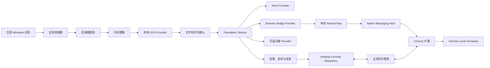
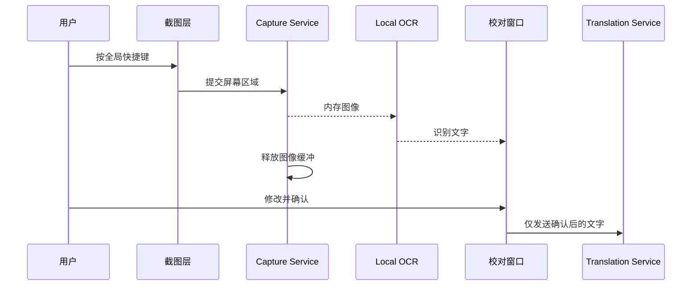

# Translator 第二阶段设计方案

文档版本：1.0  
文档状态：待评审  
目标阶段：Stage 2  
维护仓库：`Wq5881898/translator`  
最后更新：2026-07-29

## 1. 设计目标

第二阶段在保持第一阶段稳定和独立的前提下，新增一个 Windows 桌面伴侣应用，统一解决 PDF、PPT、Word 和其他桌面内容的截图 OCR 翻译。

设计重点：

1. 两个应用可独立运行；
2. 原始截图永不上传；
3. OCR 本地完成，用户确认后才翻译；
4. 翻译 Provider 可替换；
5. 收藏本地保存并主动同步；
6. 优先轻量、明确和可测试，不建设后端。

## 2. 总体架构



关键边界：

- `D → E` 只发生在本机进程内；
- 截图在 OCR 完成、取消、错误或超时后释放；
- `F → G` 传递的是用户确认后的文字，不是图片；
- Browser Bridge 和云端 Provider 都不能访问截图对象；
- 收藏同步只传收藏结构化数据，不传截图、设置或历史。

## 3. 与第一阶段的关系

### 3.1 独立性

第一阶段插件继续负责普通网页自动划词和右键翻译。第二阶段桌面应用负责跨应用截图 OCR。任一应用缺失时，另一应用的本地功能仍能正常运行。

### 3.2 共享内容

共享的是契约和数据格式，不是运行时状态：

- `TranslationRequest` 和 `TranslationResult` 消息结构；
- `FavoriteEntry` 结构；
- 文本规范化和收藏去重规则；
- CSV 列定义；
- Native Messaging 协议版本。

### 3.3 不立即重构第一阶段

为降低风险，第二阶段开始时不移动第一阶段现有目录。先新增 `desktop/`、`shared/contracts/` 和 `docs/stage-2/`。只有共享契约稳定后，才把重复类型逐步抽取到共享目录。

建议仓库结构：

```text
entrypoints/                    第一阶段扩展，保持现状
src/                            第一阶段核心，保持现状
desktop/
  Translator.Desktop/
  Translator.Application/
  Translator.Domain/
  Translator.Infrastructure/
  Translator.BridgeHost/
  Translator.Tests/
shared/
  contracts/
docs/
  stage-2/
```

## 4. 技术栈建议

### 4.1 桌面框架

优先验证 C#/.NET 桌面方案，首选 WPF：

- 对全局快捷键、托盘、多显示器、DPI 和 Windows API 集成直接；
- 不需要为桌面界面捆绑完整 Chromium；
- .NET 依赖和安装生态成熟；
- 符合轻量、Windows 优先的范围。

最终决定应由 S2-M01 技术验证确认，并记录 ADR。若 WPF 在截图层或发布体积上不满足要求，再评估 WinUI 3；首版不建议 Electron。

### 4.2 OCR

定义 `IOcrProvider`，先比较：

1. Windows 系统 OCR：优先验证，潜在体积较小；
2. Tesseract：作为可打包或可替换的备用方案。

评估维度包括：

- 英文准确率；
- 首次安装和语言包要求；
- 离线能力；
- 启动时间和内存；
- 许可与再分发；
- Windows 版本兼容性；
- 多行、标点和缩放图片表现。

在完成样本测试前不承诺把某个大型 OCR 模型直接放入安装包。

### 4.3 数据存储

桌面收藏建议使用单文件 SQLite：

- 无需服务器；
- 支持事务和唯一索引；
- 同步和批量导入时可避免部分写入；
- 后续增加同步元数据时无需立即更换存储方案。

建议位置：

```text
%LOCALAPPDATA%\Translator\translator.db
```

设置和敏感凭据分开保存。普通设置可使用本地 JSON；凭据使用 Windows DPAPI 或等效的当前用户保护机制。

## 5. 分层设计

### 5.1 Domain

仅包含稳定业务规则：

- 文本规范化和分类；
- 翻译请求和结果；
- 收藏实体和稳定 ID；
- 合并、去重和冲突规则；
- 错误代码。

Domain 不依赖 WPF、浏览器、OCR 引擎或数据库。

### 5.2 Application

组织用例：

- `CaptureAndRecognizeUseCase`
- `ConfirmAndTranslateUseCase`
- `ToggleFavoriteUseCase`
- `SyncFavoritesUseCase`
- `ImportFavoritesUseCase`
- `ExportFavoritesUseCase`

该层控制取消、超时和状态顺序，但不直接调用 Windows API。

### 5.3 Infrastructure

提供可替换实现：

- Windows 截图；
- OCR Provider；
- Browser Bridge Provider；
- SQLite 收藏仓库；
- CSV 读写；
- 语音服务；
- DPAPI 配置；
- 脱敏日志。

### 5.4 Presentation

负责：

- 托盘和快捷键入口；
- 截图遮罩；
- OCR 校对窗口；
- 翻译结果；
- 收藏窗口；
- 设置和诊断。

界面只调用 Application 用例，不直接拼装 Provider 或 SQL。

## 6. 截图与 OCR 流程



实现约束：

- 不创建临时图片文件；
- 不默认写入剪贴板；
- 内存图像用可释放对象包裹；
- 取消令牌贯穿截图和 OCR；
- 在 `finally` 中释放图像；
- 日志只记录尺寸、耗时和错误码，不记录画面或完整文字；
- 如底层库不可避免地产生临时文件，应停止采用该实现，或在产品评审中显式改变要求。

## 7. Translation Provider 设计

建议接口：

```csharp
public interface ITranslationProvider
{
    string Id { get; }
    Task<ProviderHealth> CheckHealthAsync(CancellationToken cancellationToken);
    Task<TranslationResult> TranslateAsync(
        TranslationRequest request,
        CancellationToken cancellationToken);
}
```

Provider 不负责 OCR、收藏和界面状态。

### 7.1 Provider 顺序

首版：

1. Mock Provider：开发和自动化测试；
2. Browser Bridge Provider：默认正式方案；
3. 可选 Provider 插槽：只完成配置契约，不要求首版同时实现所有云服务。

后续可实现：

- Azure Translator Provider；
- Google Translator Provider；
- LibreTranslate 自托管 Provider；
- Local Model Provider；
- 用户自带 Key 的 GPT 解释 Provider。

### 7.2 失败规则

- 每次请求使用唯一 `requestId`；
- 默认 20 秒超时；
- 新请求取消旧请求；
- 只接受与当前请求 ID 一致的结果；
- Provider 失败不得自动把文字发送给未启用的其他 Provider；
- 切换或备用必须遵循用户设置；
- 结果必须标记 Provider 来源。

## 8. 浏览器桥接方案

### 8.1 选择 Native Messaging

Chrome 扩展不能被任意桌面进程直接调用。建议由扩展建立 Native Messaging 连接，再由一个随桌面应用安装的小型 Host 通过 Windows Named Pipe 与桌面主程序通信。

```text
Desktop App
  ↕ Windows Named Pipe（仅当前用户）
Translator Bridge Host
  ↕ Chrome Native Messaging
Stage 1 Extension
  ↕ Chrome Translator API
```

不开放局域网 HTTP 端口，减少防火墙、端口冲突和远程访问风险。

### 8.2 消息协议

每条消息至少包含：

```text
protocolVersion
messageType
requestId
sentAt
payload
```

核心消息：

- `bridge.hello`
- `bridge.health`
- `translation.request`
- `translation.result`
- `translation.error`
- `favorites.snapshot.request`
- `favorites.snapshot.result`
- `favorites.merge.request`
- `favorites.merge.result`

协议要求：

- 只接受已登记的扩展 ID；
- Named Pipe 限制当前 Windows 用户；
- 文本最大 5000 字符；
- 收藏消息设定数量和总大小上限；
- 未知版本和消息类型明确拒绝；
- 不允许传截图字段；
- 错误中不回显密钥和完整敏感内容。

### 8.3 生命周期

- 桌面应用未运行时，插件继续完成第一阶段功能；
- 插件未运行时，桌面 OCR 和本地收藏继续可用；
- Host 不可用时显示诊断，不循环弹窗；
- 扩展重载或浏览器重启后支持重连；
- 安装器负责 Native Messaging 清单和当前用户注册；
- 卸载时清理 Host 注册，但不默认删除用户收藏。

## 9. 收藏仓库与同步

统一接口：

```csharp
public interface IFavoriteRepository
{
    Task<IReadOnlyList<FavoriteEntry>> ListAsync();
    Task SaveAsync(FavoriteEntry entry);
    Task RemoveAsync(string id);
    Task ImportAsync(IReadOnlyList<FavoriteEntry> entries);
    Task ExportAsync(Stream output);
}
```

对应实现：

- BrowserFavoriteRepository：第一阶段 `browser.storage.local`；
- DesktopFavoriteRepository：桌面 SQLite；
- SyncedFavoriteRepository：编排双端主动同步，不直接替代任一端存储。

### 9.1 稳定 ID

- 单词：规范化、转小写后生成稳定 ID；
- 句子：规范化完整文本后生成稳定 ID；
- 建议使用版本化哈希，如 `fav:v1:<kind>:<hash>`。

### 9.2 首版合并算法

1. 用户点击“同步收藏”；
2. 分别读取桌面和浏览器快照；
3. 按稳定 ID 建立联合集合；
4. 同 ID 冲突时：
   - `firstFavoritedAt` 取最早值；
   - 非空翻译优先；
   - 音标为空时使用另一端非空值；
   - 不静默覆盖两个不同的非空译文，记录冲突摘要；
5. 在事务中写入桌面；
6. 通过桥接写入浏览器；
7. 显示新增、合并、冲突、跳过和失败数量。

首版不传播删除。这样用户在一端误删时，不会在下一次同步中删除另一端备份。未来若需要删除同步，应引入 tombstone 和明确的冲突界面。

### 9.3 CSV

继续兼容第一阶段列：

```text
Type,English,Phonetic,Chinese translation,First saved
```

使用 UTF-8 BOM。导入必须先全量校验，确认所有行有效后再事务写入。错误在收藏窗口显示 CSV 行号。

## 10. 设置与密钥

设置分为：

- 普通设置：快捷键、语音、默认 Provider、界面偏好；
- 敏感设置：云端 Provider Key；
- 运行状态：桥接连接、OCR 引擎状态，不作为用户配置导出。

安全规则：

- Key 用 Windows 当前用户保护机制加密；
- 不进入日志、CSV、诊断包或 Native Messaging 健康消息；
- 清除设置时单独提示是否删除 Key；
- 不在安装包中预置个人或项目共享 Key；
- ChatGPT 订阅不能被桌面应用当作 API 凭据复用。

## 11. 界面方案

保持少窗口、任务导向：

1. **校对/结果窗口**：截图后自动出现，上半部分可编辑英文，下半部分显示翻译、音标、发音和爱心。
2. **收藏窗口**：默认隐藏，按单词和句子分类，提供搜索、删除、导入、导出和同步。
3. **设置窗口**：快捷键、语音、Provider、隐私和本地数据。
4. **诊断区域**：只在出现问题或用户主动打开时显示 OCR、桥接和 Provider 状态。

状态规则：

- 用户开始正式操作时清除旧测试信息；
- 当前窗口触发的错误在当前窗口显示；
- 保存设置成功后给出明确反馈并自动关闭或返回；
- 所有按钮在成功、失败或取消后恢复。

## 12. 隐私威胁模型

| 风险 | 控制 |
|---|---|
| 截图被写入临时目录 | 只使用内存 API，并增加文件系统集成测试 |
| 截图误传 Provider | Provider 请求模型不包含图像字段 |
| OCR 文本未经确认上传 | 翻译只能由确认动作触发 |
| 本地端口被其他程序调用 | 使用当前用户 Named Pipe，不开放网络端口 |
| 伪造扩展连接 | 校验允许的扩展 ID 和协议版本 |
| API Key 泄漏 | DPAPI、日志脱敏、不导出 |
| 同步覆盖收藏 | 联合合并、事务、摘要、不传播删除 |
| 日志暴露学习内容 | 默认只记录错误码和技术元数据 |

## 13. 错误模型

建议统一错误：

```text
AppError
  code
  category
  userMessage
  recoveryAction
  isRetryable
  technicalDetail?   仅脱敏诊断
```

错误类别：

- `capture`
- `ocr`
- `validation`
- `bridge`
- `translation`
- `dictionary`
- `speech`
- `storage`
- `sync`
- `import_export`
- `configuration`

界面不直接展示堆栈信息。

## 14. 测试方案

### 14.1 单元测试

- 文本规范化和分类；
- 稳定收藏 ID；
- 合并和冲突规则；
- CSV Unicode、引号、换行、错误行和事务性；
- Provider 超时、取消和旧结果隔离；
- 消息协议解析和大小限制；
- 设置规范化和密钥脱敏。

### 14.2 集成测试

- 内存截图到 OCR；
- 桌面程序到 Named Pipe Host；
- Host 到测试扩展或协议模拟器；
- SQLite 事务和迁移；
- 收藏双端快照合并；
- 安装器注册和卸载桥接。

### 14.3 人工回归

- Windows 10/11；
- 单屏、双屏、主副屏不同 DPI；
- Chrome 启动前后、扩展启用/禁用/重载；
- 网页、PDF、Word、PPT；
- 断网、本地模型未下载、Provider 超时；
- 中文、逗号、引号和换行的 CSV；
- 第一阶段自动划词、右键、收藏和设置。

### 14.4 隐私专项

- 监控临时目录和应用数据目录；
- 检查网络请求载荷；
- 搜索日志中的截图、OCR 全文和 Key；
- 强制 OCR 异常、取消和崩溃后检查残留；
- 验证桥接不接受远程访问。

## 15. CI 与发布

建议 CI：

1. 编译第一阶段扩展；
2. 运行第一阶段回归测试；
3. 编译桌面解决方案；
4. 运行 Domain、Application 和 Infrastructure 测试；
5. 运行消息协议兼容性测试；
6. 构建 Windows 安装包；
7. 检查安装包版本、文件、桥接清单和权限；
8. 上传桌面候选包、插件候选包和测试报告。

第二阶段开发应使用独立分支和 PR。技术原型通过前，不合并破坏第一阶段目录结构的大规模重构。

## 16. 关键设计决策

- 使用独立 Windows 应用，不把截图能力堆进浏览器插件。
- 两阶段可独立运行，只共享契约和用户主动同步的收藏。
- 截图本地内存 OCR，云端只接收用户确认后的文字。
- Browser Bridge Provider 是首版默认正式翻译方案。
- 不依赖“完全免费且长期稳定”的公共云端翻译服务。
- Provider 保持可替换，可选云服务由用户自行配置。
- 桌面收藏本地保存，首版使用主动合并，不自动传播删除。
- 优先 .NET/WPF、Native Messaging、Named Pipe 和 SQLite，但均先通过技术验证再冻结。
- 不把翻译次数统计、账户、云同步、商业词典或 GPT 自动调用加入首版。

## 17. 后续演进

核心版本稳定后可按需增加：

- 自托管 LibreTranslate；
- Azure 或 Google 用户自带凭据；
- 更高准确率的可选 OCR 引擎；
- 个人专业词库优先匹配；
- 用户自带 API Key 的语境解释；
- 带 tombstone 的删除同步；
- 翻译次数与复习计划。

任何演进都必须保持截图不上传、来源可识别、用户主动配置和两个阶段独立运行的原则。

